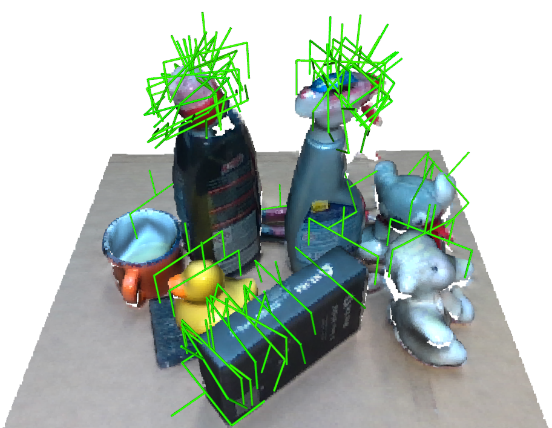
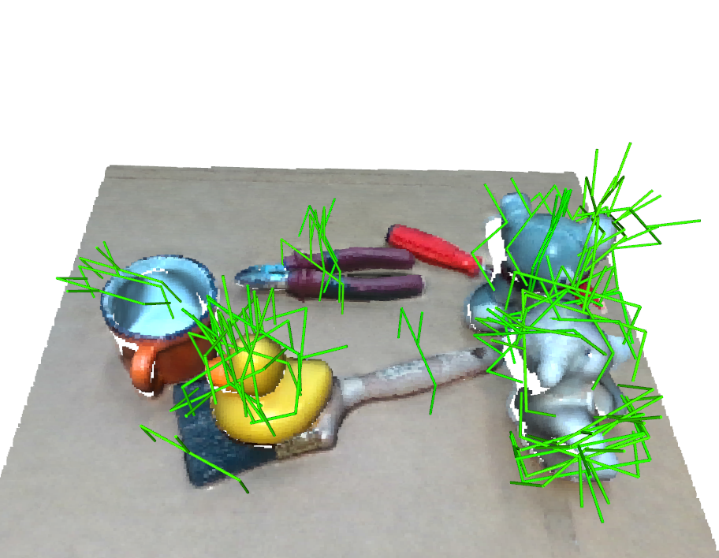
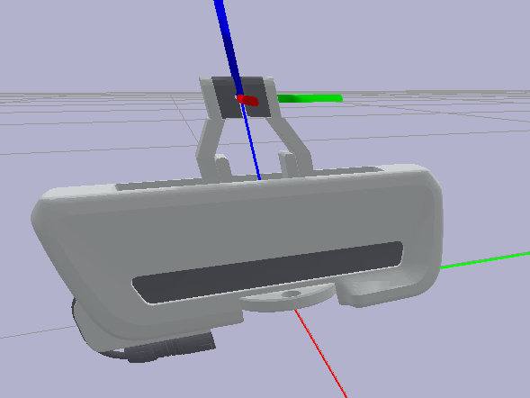

# Continual Learning for 6-DoF Grasp Synthesis via Experience and Demonstrations

This repository (`grasp-learning-cl`) contains the grasp-detection and
continual-learning models used in our grasp-learning research code. It operates
on single-view point clouds and provides model training, 6-DoF grasp inference,
heuristic proposal generation, grasp recall, and online adaptation from
experience and demonstrations.

<table>
  <tr>
    <td width="50%"></td>
    <td width="50%"></td>
  </tr>
  <tr>
    <td colspan="2" align="center">
      <sub>
        Grasp proposals generated from single-view point clouds of real-world
        scenes captured with an Intel RealSense D435 and reconstructed using
        <a href="https://github.com/NVlabs/Fast-FoundationStereo">Fast-FoundationStereo</a>.
        See
        <a href="https://github.com/giuschio/realsense-utils-public">RealSense Utilities</a>
        for point-cloud reconstruction and
        <a href="https://github.com/giuschio/simple-panda-grasp-public">Simple Panda Grasp</a>
        for robot deployment.
      </sub>
    </td>
  </tr>
</table>

## Associated paper and code

This repository is part of the code release for our CoRL 2026 paper:

> **Continual Learning for 6-DoF Grasp Synthesis via Experience and
> Demonstrations** \
> Giulio Schiavi, Andrei Cramariuc, Michael Pantic, and Roland Siegwart
>
> [Paper](https://arxiv.org/abs/2610.01301) |
> [Project page](https://giuschio.github.io/cl_grasping/)

The paper code is split into reusable repositories:

- **[Simulation environment](https://github.com/giuschio/grasp-env-public):**
  scene generation, data collection, and simulated grasp evaluation.
- **Grasp detection model (this repository):** model training, grasp inference,
  recall, and continual adaptation.
- **[Robot control and deployment](https://github.com/giuschio/simple-panda-grasp-public):**
  camera calibration, real-world perception, reachability checks, and grasp
  execution.
- **[Paper benchmark](https://github.com/giuschio/graspcl-benchmark-public):**
  the top-level reproduction repository that combines the components above and
  provides the paper experiments.

For end-to-end reproduction, use the benchmark repository. This repository can
also be used independently to train a model, generate grasp proposals, and
adapt their scoring online.

If you use this package in your research, please cite:

```bibtex
@misc{schiavi2026continuallearning6dofgrasp,
  title         = {Continual Learning for 6-DoF Grasp Synthesis via Experience and Demonstrations},
  author        = {Giulio Schiavi and Andrei Cramariuc and Michael Pantic and Roland Siegwart},
  year          = {2026},
  eprint        = {2610.01301},
  archivePrefix = {arXiv},
  primaryClass  = {cs.RO},
  url           = {https://arxiv.org/abs/2610.01301}
}
```

## Installation

Python 3.10 or newer is required. Install PyTorch for the machine first.

```bash
python -m pip install torch
```

For CUDA, use the command for the installed CUDA version from the PyTorch
installation selector. Then install the learning stack and this package:

```bash
python -m pip install pytorch-lightning torch-geometric
python -m pip install -e .
```

## Running the Example Scripts

Download one of the ready-to-use continual-learning modules before running the
examples:

- [Base pretrained checkpoint](https://drive.google.com/file/d/1NmVhcZmMaN-iJYRQDLghj34PMBtEPA8v/view?usp=sharing),
  representing the model before online feedback; or
- [Adapted checkpoint](https://drive.google.com/file/d/1fDHUEpCshSCfK9AyjLpG6SmaPak9naQ-/view?usp=sharing),
  an alternative that has already undergone online adaptation.

### Inference

Inference expects a single-view, Open3D-readable scene point cloud in metres.
Whenever possible, pass the complete view **including the support table**. The
table is used by the model's internal collision avoidance, so retaining it
generally produces safer, better-filtered grasp proposals. Point-cloud normals
are also required.

```bash
python scripts_inference/infer_from_pointcloud.py \
  --cl_module_path /path/to/cl_module \
  --pointcloud_path /path/to/cloud_w_table.ply \
  --visualize
```

The script prints the number of retained grasps and the best score. Remove
`--visualize` for headless use.

The equivalent library entry point is
`ContinualLearningModule.load_inplace(...)`, followed by `predict(...)`. Returned
grasps are Python dictionaries with these core fields:

| Field | Meaning |
| --- | --- |
| `pose` | `4 x 4` world-from-grasp transform described below. |
| `width` | Requested gripper opening in metres. |
| `point1` | First nominal fingertip/contact point in world coordinates. |
| `point2` | Second nominal fingertip/contact point in world coordinates. |
| `score` | Scalar used to rank the proposal. |

Depending on how a grasp was produced or adapted, the dictionary can also
contain `proposal_source` (`sampler`, `recall_object`, or `recall_patch`),
`success`, real-robot `pose_pre` and `pose_post` transforms, the learned
`feature_encoder`, probabilistic parameters `a` and `b`, or `recall_distance`.
Callers should preserve unknown fields when copying a grasp so this metadata is
not discarded.

### Adaptation

The standalone adaptation example copies a base CL module, predicts the
top-ranked grasp for one point cloud, asks whether it succeeded, and adds that
binary outcome to the online scoring memory:

```bash
python scripts_inference/adapt_from_feedback.py \
  --cl_module_path /path/to/cl_module \
  --output_path /path/to/adapted_cl_module \
  --pointcloud_path /path/to/cloud_w_table.ply \
  --object_type category-mug
```

Use a new output directory. The source module is copied before adaptation and is
left unchanged. To apply another feedback step, use the previous adapted module
as `--cl_module_path` and another new directory as `--output_path`. The script
updates the checkpoint's training metadata and per-category feedback counts.

This example handles binary outcomes only. Applications that collect
demonstrated grasps can call `ContinualLearningModule.add_demonstration(...)`;
both outcome and demonstration updates must be followed by `save(...)`.

To return an adapted module to its offline state, remove its online scoring and
recall data with:

```bash
python scripts_inference/manage_cl_module.py \
  --cl_module_path /path/to/cl_module \
  drop-online-data
```

This operation asks you to type `yes` before deleting anything. It removes the
online scoring memory and both recall databases, and resets feedback/adaptation
metadata. The offline scoring memory and encoder are preserved.
## Grasp Pose Convention

This repository assumes the geometry and frame convention of a **Franka Emika
Panda Hand**, a parallel-jaw gripper with a maximum opening of 80 mm. A returned
grasp's `pose` is a `4 x 4` homogeneous transform
`T_world_grasp = [R | t; 0 0 0 1]`, expressed in metres. It maps a point from
the local grasp/Panda-hand frame into the point-cloud (world) frame:

```text
p_world = R @ p_grasp + t
```

The translation `t = pose[:3, 3]` is the grasp centre: the midpoint between the
two fingers at the intended contact depth. It is a virtual frame in front of
the physical Panda-hand base, rather than the robot flange or wrist position.
The columns of `R = pose[:3, :3]` are the local axes expressed in world
coordinates:

- `R[:, 0]` is **+x**, orthogonal to the closing and approach axes and chosen to
  complete a right-handed frame;
- `R[:, 1]` is **+y**, the gripper closing/opening axis, from one finger toward
  the other; and
- `R[:, 2]` is **+z**, the hand's forward/approach axis, from the palm toward
  the fingertips and grasped object. Moving in `-z` retracts the hand.

Consequently, the nominal contacts are `point1 = t + width / 2 * R[:, 1]` and
`point2 = t - width / 2 * R[:, 1]` (the built-in samplers use the Panda's
80 mm maximum width). Swapping the two fingers produces an equivalent
parallel-jaw grasp but reverses x and y. The point cloud, the translation, and
all three axes must use the same world frame.



The figure follows the standard axis colours: x is red, y is green, and z is
blue. Collision dimensions, the 80 mm opening limit, and the offsets used by
the proposal samplers are Panda-specific. Supporting another gripper therefore
requires updating both the pose-to-tool transform and those geometry settings;
changing only `width` is not sufficient.

## Training a Checkpoint

The PyBullet-generated dataset used to train the base model is available here:

- [PyBullet-generated training dataset](https://drive.google.com/file/d/1v-lhZYan9TlCWyW2Fr1JODtZoZu-6mw2/view?usp=sharing)

Training expects one directory per scene. Scene directories are naturally
sorted and split 60%/20%/20% into training, validation, and test sets. Each
scene must contain:

- `cloud_w_table.ply`, an Open3D-readable point cloud containing the scene and
  support table; and
- `grasps.csv`, despite its name a JSON Lines file containing one JSON object
  per grasp. It is not a comma-separated table.

```text
training_data/
  scene_000000/
    cloud_w_table.ply
    grasps.csv
  scene_000001/
    cloud_w_table.ply
    grasps.csv
```

Every training row must contain `pose`, `width`, `point1`, `point2`, and a label.
The default label key is `success_binary`; select another field with
`--label_key`. Arrays are JSON lists, and `pose` is flattened in row-major order
to 16 numbers when stored on disk. For example:

```json
{"pose":[1,0,0,0.42,0,1,0,-0.08,0,0,1,0.31,0,0,0,1],"width":0.08,"point1":[0.42,-0.04,0.31],"point2":[0.42,-0.12,0.31],"success_binary":1}
```

On loading, `pose` is reshaped to `4 x 4`. Older comments in the code that
describe it as a seven-element translation/quaternion vector are legacy and do
not describe the current data format. `cloud_no_table.ply` is also supported;
choose it explicitly with `--cloud_filename cloud_no_table.ply` and use the
same choice throughout training and module creation.

The intended training procedure has two stages. First train the reconstruction
autoencoder:

```bash
python scripts_training/1_train_encoder.py \
  --model_type pure_autoencoder \
  --dataset_root /path/to/training_data \
  --output_dir /path/to/encoder_runs \
  --cloud_filename cloud_w_table.ply
```

The script prints the path of the best Lightning checkpoint. Use it to
initialize the supervised soft-nearest-neighbor autoencoder:

```bash
python scripts_training/1_train_encoder.py \
  --model_type snn_autoencoder \
  --dataset_root /path/to/training_data \
  --output_dir /path/to/encoder_runs \
  --cloud_filename cloud_w_table.ply \
  --load_initial_weights /path/to/pure_autoencoder/checkpoints/best.ckpt
```

Next, fit the probabilistic offline scoring memory and package it with the
encoder configuration as a continual-learning module:

```bash
python scripts_training/2_make_cl_module.py \
  --encoder_path /path/to/snn_autoencoder/checkpoints/best.ckpt \
  --training_data_path /path/to/training_data \
  --output_path /path/to/cl_module \
  --cloud_filename cloud_w_table.ply \
  --internalize_encoder
```

Use the same `--cloud_filename` for encoder training and CL-module creation.
`2_make_cl_module.py --help` lists the score-model and temperature-search
settings. The resulting portable CL-module directory contains `config.json`,
`feedback_counts.json`, `encoder/`, `score_cl/`, `recall/`, and
`recall_patches/`.

### Checkpoint metadata

Training metadata is managed by `ContinualLearningModule` through
`load_training_metadata(modules_root)`,
`infer_train_object_set(modules_root)`, `update_training_metadata(...)`, and
`format_training_feedback_counts(...)`. A base module created from offline data
records:

```json
{
  "base_train_object_set": "base",
  "train_object_set": "base"
}
```

After online adaptation, the metadata adds the adapted categories and a
per-category snapshot of labels and demonstrations:

```json
{
  "base_train_object_set": "base",
  "adaptation_object_sets": ["category-mug"],
  "train_object_set": "base+category-mug",
  "feedback_counts": {
    "category-mug": {"labels": 12, "demonstrations": 3}
  }
}
```

The CL-module configuration stores both `encoder_path` and `encoder_location`.
For an `internal` encoder, `encoder_path` is relative to the CL-module directory,
so the entire directory can be moved or shared as one unit. For an `external`
encoder, the path retains the previous behavior and points outside the module.
Configs created before `encoder_location` was introduced are treated as
`external` for compatibility. Omit `--internalize_encoder` when the external
checkpoint should remain in place.

To make an existing module portable, run:

```bash
python scripts_inference/manage_cl_module.py \
  --cl_module_path /path/to/cl_module \
  internalize-encoder
```

This copies its current encoder checkpoint into `cl_module/encoder/` and updates
the configuration to use the relative internal path.
